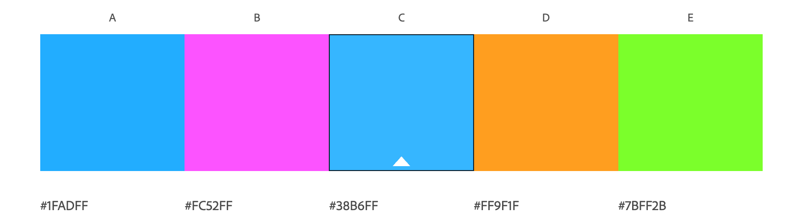
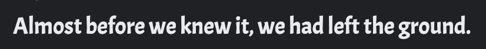
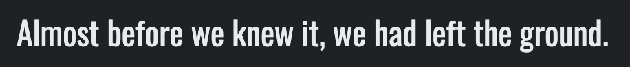
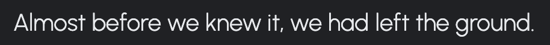
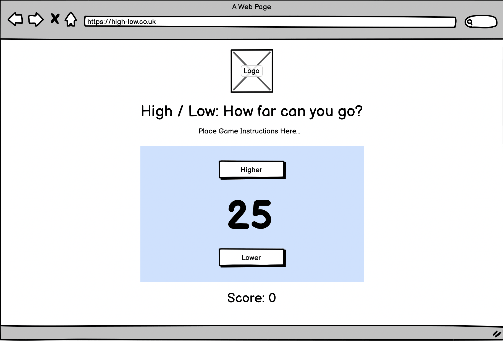
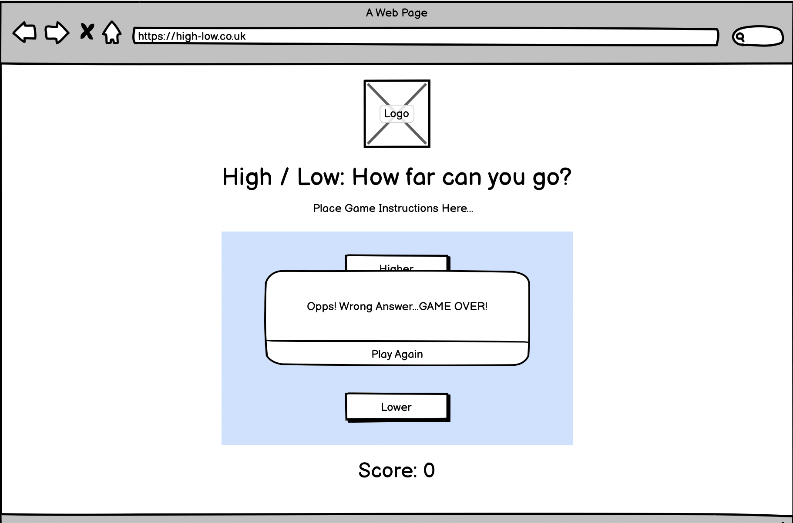
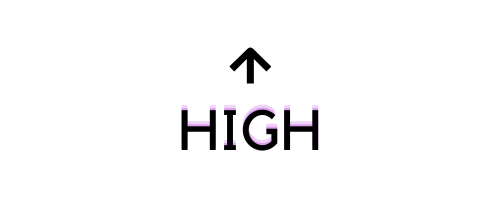
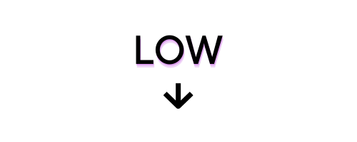

<h1 align="center">High / Low - How far can you go?</h1>

ADD RESPONSIVE IMAGE HERE!!!!!!

ADD LINK TO REPOSITORY HERE!!!!

ADD LINK TO WEB PAGE HERE!!!!

# About
High / Low is a game of chance involving, as the title suggests, picking between a higher or lower number than the one randomly generated. This game is targeted for those who enjoy a simple arcade style games that are based on decision making using probability as a foundation. 

The use of JavaScript enables the random selection of a number an also allows the difficulty of the game to increase with each level and the range of numbers grows, starting from 0 - 25 up to 0 - 500.

# Table of Contents

[User Experience](#user-experience)

[Features](#features)

[Features to be Implemented](#features-to-be-implemented)

[Technologies Used](#technologies-used)

[Testing](#testing)

[Validator Testing](#validator-testing)

[Bugs Found](#bugs-found)

[Deployment](#deployment)

[Credit](#credit)

[Acknowledgments](#Acknowledgments)

# User Experience
## User Stories

## Design

### Colour Scheme
I have chosen to use pops of bright colours on a dark background to tie in with the theme of a simple arcade style game. The colour is used to grab the users attention to the area of play. 

 The colors used are #38B6FF (a light blue) for the buttons, #FC52FF (a neon pink) for the button borders and #7BFF2B (a neon green) for the button highlight when the mouse hovers over. 
 These were chosen using a square complimentary approach of the color theory generated by [Adobe Color Wheel](https://color.adobe.com/create/color-wheel) .

 

### Typography

The main font used was 'Acme', Sans-serif. I chose this font as I thought it's playfulness suited the game I was creating but was still easily readable. 

I also used the fallback fonts of:
- 'Oswald' sans-serif, 

 
 
 - 'Urbanist' sans-serif

 

### Wireframes

- The following wireframes were created in Balsamiq, the were followed closely to acheieve the final outcome. 

 

 

### Other Details
- I intentionally designed the button images to flow like an arrow head, up for higher and down for lower. I also, added some pink contrast to the text to tie in with the colour scheme. 

- The same theme was applied to the design of the logo, with the shape pointing in both up and down directions. 

# Features

- Game Heading & Logo 

- Game Aim 

- Game Area 
The user clicks the buttons to make their choice, if they are correct an alert will appear to confirm this and the score will increment by 1 point. If they are incorrect, an alert will apear to tell them this and they game will start from the beginning. 

- Score 

## Features to be Implemented

- Additional games could be added such as rock, paper, scissors or a matching game using colours or numbers (similar to the card game pairs). 

- Scoreboard containing the top 10 highest scores with the date acheived 

# Technologies Used
# Testing
# Validator Testing
# Bugs Found 
# Deployment 
# Credit
## Content 

The images were designed and downloaded using [Canva Pro](https://www.canva.com/). 
## Media 
# Acknowledgments

