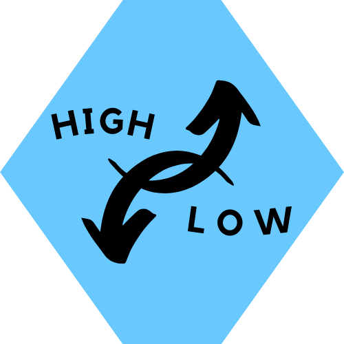

<h1 align="center">High / Low - How far can you go?</h1>

ADD LINK TO REPOSITORY HERE!!!!

ADD LINK TO WEB PAGE HERE!!!!

# About
High / Low is a game of chance involving, as the title suggests, picking between a higher or lower number than the one randomly generated. This game is targeted for those who enjoy a simple arcade style games that are based on decision making using probability as a foundation. 

The use of JavaScript enables the random selection of a number an also allows the difficulty of the game to increase with each level and the range of numbers grows, starting from 0 - 25 up to 0 - 500.

# Table of Contents

[User Experience](#user-experience)

[Features](#features)

[Features to be Implemented](#features-to-be-implemented)

[Technologies Used](#technologies-used)

[Testing](#testing)

[Validator Testing](#validator-testing)

[Performancce Testing](#performance-testing)

[Bugs Found](#bugs-found)

[Deployment](#deployment)

[Credit](#credit)

[Acknowledgments](#Acknowledgments)

# User Experience
## User Stories
- As a visitor who needs something to break up their day
    * I want to easily understand the rules and layout of the game without additional instructions needed, however still provided. 
    * I want to intuitively understand how the game works. 
- As a visitor who enjoys chance games 
    - I want to play a simple game that is also challenging in its range of choice 
    * I want to intuitively understand how the game works. 
- As a visitor who wishes to be entertained 
    * I want a game that is catchy and addictive without being too difficult 
    * I want a game that I do not have to keep up with a story line 

## Design

### Colour Scheme
I have chosen to use pops of bright colours on a dark background to tie in with the theme of a simple arcade style game. The colour is used to grab the users attention to the area of play. 

 The colors used are #38B6FF (a light blue) for the buttons, #FC52FF (a neon pink) for the button borders and #7BFF2B (a neon green) for the button highlight when the mouse hovers over. 
 These were chosen using a square complimentary approach of the color theory generated by [Adobe Color Wheel](https://color.adobe.com/create/color-wheel) .

 

### Typography

The main font used was 'Acme', Sans-serif. I chose this font as I thought it's playfulness suited the game I was creating but was still easily readable. 

I also used the fallback fonts of:
- 'Oswald' sans-serif, 

 
 
 - 'Urbanist' sans-serif

 

### Wireframes

- The following wireframes were created in Balsamiq, the were followed closely to acheieve the final outcome. However, there was a change in the header and Game Instructions moved into a popup window. 

 

 

- The below is a screenshot of the final page layout 

 

### Other Details
- I intentionally designed the button images to flow like an arrow head, up for higher and down for lower. I also, added some pink contrast to the text to tie in with the colour scheme. 

- The same theme was applied to the design of the logo, with the shape pointing in both up and down directions. 

# Features

- Game Logo, Heading, and How to Play Button 

- Game Instructions: 
Click on the How to Play button and the Game Instructions appear via a popup window.

 

- Game Area:
The user clicks the buttons to make their choice, if they are correct an alert will appear to confirm this and the score will increment by 1 point. If they are incorrect, an alert will apear to tell them this and they game will start from the beginning. 

- Score 
Increments by 1 with each correct answer and automatically resets to 0 when user answer is incorrect.

## Features to be Implemented

- Levels could be implemented by increasing the number range as the scores reach certain stages.

- Scoreboard containing the top 3 highest scores with the date acheived.

- Lives could be added to give the user 3 chances. Lives could also increase if they reach certain checkpoints.

- Additional games could be added such as rock, paper, scissors or a matching game using colours or numbers (similar to the card game pairs). 

# Technologies Used

### Languages Used

[HTML5](https://en.wikipedia.org/wiki/HTML5)

[CSS](https://en.wikipedia.org/wiki/CSS)

[JavaScript](https://en.wikipedia.org/wiki/JavaScript)

### Frameworks, Libraries and Programmes Used 

[JSFiddle](https://jsfiddle.net/) to double check code and functionality before added to Gitpod. 

[GitHub](https://github.com/) - Used to hold a repository of my project and deploy the live website to Git Pages, making it public.

[GitPod](https://gitpod.io/workspaces) – Connected to GitHub, GitPod hosted the coding space, allowing the project to be built and then committed to the GitHub repository. 

[Google Fonts](https://fonts.google.com/) - Used to import 'Gotu' and 'Open Sans' fonts into the style sheet. 

[Favicon Generator](https://favicon.io/favicon-converter/) - Used to convert a .png file into a Favicon.

[Canva](https://www.canva.com/) - Used to decide inital colours for the project.

# Testing

## Functionality 
The game was tested using console.logs to ensure the code was calculating the correct answer and incrementing/decreasing the score as it should. 

To test the site the usability and the functionality of the game I also shared the deployed site with a few friends and family members of different ages to confirm ease of use. As far as they could see there weren’t any issues with understanding how to play the game, the functionality of the game and the layout on their screens. 

## Compatibility Testing
Devices Tested with:
- Apple MacBook Pro 13”
- Razer Blaze Pro 17.3”
- iPad OS 14.6
- Apple iPhone X
- Apple iPhone XR Plus
- Samsung S10+
- Samsung Galaxy Z Flip3 

Web Browsers tested on:
- Google Chrome
- Safari
- Microsoft Edge
Chrome DevTools was also extensively used to test responsiveness. 

# Validator Testing

- HTML

No errors were returned when passing through the official W3C validator.

- CSS

No errors were found when passing through the official (Jigsaw) validator.
Warnings were flagged for background colour of the Play Button as it matched the background colour of the document but it is required as without a set background colour for the image the background displays white for the button. 

- JavaScript

No errors were found when passing through [JS Hint](https://jshint.com/). 

Also put through [WAVE](https://wave.webaim.org/) to test colour contrast through out.

# Performance Testing
The performance testing of the site was completed using WebPageTest with the location set as London and browser Google Chrome.

The following results was received:

Areas of improvement are Security and Cache Static Content which are not part of this projects scope but I will work on these for future projects.

# Bugs Found 
No bugs found. 

During development the following issues occured but were fixed prior to deployment:
- A new random number wasn't automatically replacing on the screen the previous number
- The correct answer wasn't being calculated and then compared with the users answer
- A new random number wasn't being generated after each user guess
- The play button generated a new number every time it was pressed but didn't start the game over as it should so the user could skip a number if they felt it would be difficult to guess correctly
# Deployment 

This project has been publish on [GitHub Pages](https://github.com/SamanthaBooth81/High-Low-Game). 

To deploy my site to GitHub Pages I completed the following steps:    

- Ensured all code had been committed and pushed into my GitHub Repository. 

- clicked on **Settings**, found at the end of the navigation bar within the Repository.

- Once in Settings, scrolled down and clicked on **Pages** located near the bottom of the left navigation bar.

- Saved the **Source** as **Root** to ensure the webpage will be built from the main branch.

- Once the source had been saved, GitHub Pages generated a link to my live site. 

# Credit
## Content 

- The images were designed and downloaded using [Canva Pro](https://www.canva.com/). 

- Code for generating the Random Number was sources from [WordPress Development](https://wordpress.stackexchange.com/questions/354184/insert-a-button-on-a-page-with-random-number-generation).

- I used this [YouTube Video](https://www.youtube.com/watch?v=iE_6pQ3RlZU) video to help create a popout window for the game instructions. 

# Acknowledgments
Thank you to all who encouraged and supported me as I created my first game, espcially to my mentor for his guidance and patience. 

